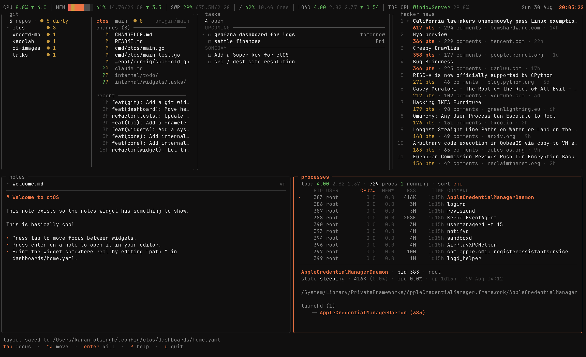

# ctOS

**Your terminal's central operating system.**

ctOS is a terminal control plane. You compose dashboards from widgets in YAML, switch between
them, and act on what you see; edit a note, open a story, kill a process. When you need a real
tool, an action hands the whole terminal to it and gives it back when you quit.

> Status: **v0.1** early. The scaffold works; remote monitoring over SSH is next.



## Install

```sh
go install github.com/0xquark/ctos/cmd/ctos@latest
```

Or from source:

```sh
git clone https://github.com/0xquark/ctos
cd ctos
make build && ./ctos
```

## Quick start

```sh
ctos init    # write a starter config
ctos         # open your dashboard
```

`ctos init` creates `~/.config/ctos/config.yaml` and `~/.config/ctos/dashboards/home.yaml`.
Edit them and restart.

## Controls

| Key | Does |
|---|---|
| `tab` / `shift+tab` | move focus between widgets |
| `↑` `↓` (or `k` `j`) | navigate inside the focused widget |
| `enter` | the focused widget's primary action |
| `r` | refresh the focused widget |
| `ctrl+l` | rearrange the layout (`b` moves the status bar) |
| `ctrl+t` | next theme |
| `?` | toggle full help |
| `q` | quit |

The same key does the same thing in every widget.

Widgets may add their own keys on top — the `processes` widget uses `c`/`m`/`p`/`n` to sort,
`/` to filter and `d`/`l` for its detail pane. While a widget is taking text input, it owns the whole keyboard, so `q` types
a `q` instead of quitting; `esc` gets you out.

### Status bar

A dashboard can pin widgets above the grid as a frameless strip:

```yaml
widgets:
  vitals:
    type: system
    style: bar
  clock:
    type: clock

bar:
  left: [vitals]
  right: [clock]

rows:
  - [notes, processes]
```

`bar: [vitals]` is the short form when nothing needs to sit on the right. The right-hand group is
measured first and the left gets what is left over, because the right is the fixed part: a clock
is as wide as a clock, while a vitals strip fills whatever it is given. It is capped at a third
of the width, since it is a trailing detail rather than the point of the bar.

```
 CPU 13.0% │ MEM █████▒▒░ 66% 15.9G/24.0G │ SWP 45% 1.3G/3.0G │ / 67% 8.4G free │ LOAD 3.12 2.92 2.61        Sun 30 Aug  15:57:18
```

The bar is chrome, not a pane. It has no border and no title, `tab` never lands on it, and the
arrows in layout mode cannot push a widget into it — a widget with no cursor and no actions is
not somewhere focus should be able to get stuck. It is as tall as its contents need, up to three
lines, and the rows below give back exactly that much: on a terminal too short for both, the
dashboard keeps a row and the bar is the thing that shrinks. A strip asks for exactly one line.

Any widget type can go there. `system` with `style: bar` is what the left-hand side is for, and
the `clock` collapses to a single line of text when it is one line tall — which is where a
terminal expects the time to be, and a great deal less of the screen than a pane of block digits.

#### Putting the bar somewhere else

In ctOS, press `ctrl+l` for layout mode and then `b` to move the bar round the four edges;
`s` saves it back to the dashboard file, `esc` puts it back. In YAML it is `position:` — `top`
(the default), `bottom`, `left` or `right`:

```yaml
bar:
  position: right
  width: 30
  top: [vitals]
  bottom: [clock]
```

The group keys follow the orientation, because "left" means nothing on a bar that runs
vertically. A `top` or `bottom` bar takes `left:` and `right:`; a `left` or `right` bar takes
`top:` and `bottom:`. Either way the second group is the trailing one, pinned to the far end and
measured first.

`width:` belongs only to a vertical bar, and defaults to 24 columns. A strip's height is its
content's to choose — a line of vitals either fits or it does not — but a column's width is not:
it is how much of the screen you are willing to spend on chrome. It is clamped down when the
terminal is too narrow to carry both, and below eight columns the bar disappears rather than
starve the grid, the same promise the horizontal bar makes about keeping one row.

`system` follows the bar on its own: its default `style: auto` draws the strip when it is one
line tall and the panel of labelled bars when it is taller, so the same widget reads correctly
across the top of the screen and down the side of it. `style: bar` or `style: rows` pins one.

In a column the panel changes shape too. A side bar is the opposite trade from a grid pane — no
width, and more height than seven vitals need — so each metric is drawn *down* the pane rather
than across it:

```
╭─ notes ──────────────────╮
│ welcome.md               │  cpu                    22%
│ ideas.md                 │  ██████░░░░░░░░░░░░░░░░░░░░
│                          │  ▃▃▃▃▄▄▄▄▄▄▄▂▂▂▂▂▃▃▃▃▃▃▃▃▃▃
│                          │  17 us · 5 sy
│                          │
│                          │  mem                    67%
│                          │  █████████████████░░░░░░░░░
│                          │  ▆▅▅▅▅▅▅▅▅▆▆▆▆▆▆▆▅▅▅▅▅▅▅▅▆▆
│                          │  16G/24G
│                          │
│                          │  net ↓ 26K/s  ↑ 48K/s
│                          │
│                          │  load                  4.62
│                          │  ██████████░░░░░░░░░░░░░░░░
│                          │  ▄▄▅▄▄▃▄▄▅▅▄▄▃▃▄▄▅▅▄▄▃▃▄▄▅
│                          │  3.76 3.33 · 12 cores
╰──────────────────────────╯  Sun 30 Aug  16:40:08
 tab focus  ·  ↑↓ move  ·  ? help  ·  q quit
```

The bar takes the block's full width, the history gets a line of its own — eight cells show a
direction, a full line shows the shape of the last few minutes — and the values with no bar to
draw, throughput and uptime, sit beside their label. All three are things the flat row had to cut
for want of width.

Blocks are packed from the top with one blank line between them, and the height a column has left
over stays at the bottom in one piece. Spreading it out as a gap between every metric pushes apart
values that are read together, and the panel stops looking like one thing. If the space bothers
you, a bar group takes more than one widget — `top: [vitals, processes]` splits the column between
them — or give the bar a shorter dashboard to sit beside.

Widgets in a vertical group stack where widgets in a strip sit side by side, and the footer is
never an edge the bar can take: it is the shell's own line and stays below everything.

### Rearranging the layout

Press `ctrl+l` to pick up the focused widget and move it around:

| Key | Does |
|---|---|
| `←` `→` | reorder within the current row |
| `↑` `↓` | move to the row above or below, keeping the column |
| `enter` | split out into a new row |
| `tab` | pick a different widget to move |
| `s` | save the arrangement back to the dashboard file |
| `esc` | cancel and restore the previous layout |

Saving rewrites only the `rows:` key. Your comments, widget settings and `${VAR}` references
are left exactly as you wrote them.

## Configuration

Two files, both optional — ctOS runs on defaults without them.

**`~/.config/ctos/config.yaml`** — global settings:

```yaml
editor: ${EDITOR:-vi}       # opens files; falls back to $EDITOR, then vi
default_dashboard: home
theme:
  name: ember               # see "Themes" below; ctrl+t cycles them
  accent: "#4fb8cc"         # optional: overrides just that theme's accent colour
refresh:
  default: 30s              # for widgets that set no interval
```

**`~/.config/ctos/dashboards/home.yaml`** — one dashboard:

```yaml
name: home

widgets:
  clock:
    type: clock
    format: "15:04:05"
  notes:
    type: notes
    path: ~/notes
  tasks:
    type: tasks
    path: ~/notes/tasks.md
  hackernews:
    type: hackernews
    limit: 20
    refresh: 5m

rows:
  - [tasks, notes]
  - [clock, hackernews]
```

Widgets are named under `widgets:`, then arranged by `rows:`. Widgets sharing a row split the
width evenly. Omit `rows:` and each widget gets its own full-width row.

Any string value may reference the environment as `${VAR}` or `${VAR:-default}`, so dashboards
stay shareable and secrets stay out of the file.

### Themes

Press `ctrl+t` in ctOS to cycle through them. The dashboard repaints immediately and the choice
is written back to `config.yaml`, so it survives a restart. `ctos themes` prints the list with a
swatch of each:

| Theme | Look |
|---|---|
| `ember` | orange on neutral grey — the default |
| `ctos` | muted cyan on cool slate, bracketed frames |
| `dedsec` | acid lime and magenta, high contrast |
| `blume` | clinical corporate blue |
| `noir` | near-monochrome; colour only where something is wrong |

Plus ports of eight published schemes, with thanks to their authors:

| Theme | Upstream |
|---|---|
| `catppuccin` | [Catppuccin](https://catppuccin.com) — Mocha, with Latte as the light variant |
| `dracula` | [Dracula](https://draculatheme.com) — with Alucard as the light variant |
| `gruvbox` | [gruvbox](https://github.com/morhetz/gruvbox) — dark and light, medium contrast |
| `nord` | [Nord](https://nordtheme.com) |
| `onedark` | [One Dark](https://github.com/atom/atom) — with One Light |
| `rosepine` | [Rosé Pine](https://rosepinetheme.com) — Main, with Dawn as the light variant |
| `solarized` | [Solarized](https://ethanschoonover.com/solarized) — dark and light |
| `tokyonight` | [Tokyo Night](https://github.com/enkia/tokyo-night-vscode-theme) — with Tokyo Night Day |

Each port uses the upstream project's *own* light variant for light terminals, rather than a
dark scheme with a guessed light mode. Nord is the exception — it publishes no light variant, so
its Polar Night greys are used as ink on Snow Storm.

```yaml
theme:
  name: ctos
```

A theme sets every colour ctOS draws with — the accent, the three text weights, the
good/warn/bad the vitals and task counts use, and the runes its frames are drawn with. Each one
is defined for a light terminal as well as a dark one, so `ctos` on a white background is deep
teal ink rather than cyan on black.

`accent:` overrides just the accent — focus borders, selections, highlights — and leaves the
rest of the theme alone, so a palette you like in a colour you like is one line:

```yaml
theme:
  name: noir
  accent: "#9ae64a"
```

It applies to the theme you wrote it under. Pressing `ctrl+t` removes it, because the theme you
switched to brings its own accent — an override carried across would tint every palette in the
last one's colour.

An unknown name stops startup and lists the alternatives, rather than quietly falling back.

### Config location

Resolved in this order:

1. `--config-dir <path>`
2. `$CTOS_CONFIG_DIR`
3. `~/.ctos` — with `--home-config`
4. `$XDG_CONFIG_HOME/ctos`
5. `~/.config/ctos`
6. `~/.ctos` — if it already exists

## Widgets

Run `ctos widgets` to list what your build supports, and `ctos widgets <type>` for one
widget's keys as a block you can paste into a dashboard.

Every widget takes `title`, the label drawn on its frame. It defaults to the type's own name
(`hacker news` for `hackernews`), and `title: ""` leaves the frame bare. The keys below are
the ones each type adds.

### `clock`

| Key | Default | Meaning |
|---|---|---|
| `format` | `15:04:05` | [Go time layout](https://pkg.go.dev/time#pkg-constants) |
| `date_format` | `Mon 02 Jan 2006` | date, below the time in a pane and before it on one line |
| `big` | `true` | draw large digits when there is room |

Given one line — in the [status bar](#status-bar), or a pane one row tall — it renders as
`Mon 02 Jan  15:04:05` and nothing else, with no padding, so that whatever placed it can align
it. The date is dropped rather than truncated when there is no room, since half a date is worse
than none and the time is the point.

### `system`

The machine at a glance, in one of two styles. `style: rows` is a panel — one labelled bar per
vital, with a sparkline behind the ones that move. `style: bar` is a status strip: pipe-separated
values across the width of the terminal, meant for the dashboard's [status bar](#status-bar).

The default, `style: auto`, picks from the shape of the box: one line is a strip, anything
taller is a panel. Which one is right is a fact about where the widget was put rather than about
the widget, so a dashboard does not have to restate it every time the bar moves edge.

| Key | Default | Meaning |
|---|---|---|
| `style` | `auto` | `auto` to follow the box, `rows` for the panel, `bar` for the status strip |
| `refresh` | `3s` | poll interval, minimum `1s` |
| `metrics` | see below | what to show, in order: `cpu`, `mem`, `swap`, `disk`, `diskio`, `net`, `load`, `top`, `uptime` |
| `disks` | `["/"]` | one entry per mount point; `[]` for none |
| `interface` | *(all but loopback)* | network interface to measure |
| `history` | `true` | draw the sparklines |
| `deltas` | `true` | show each value's change over the last 30s (`bar` style) |

`metrics` defaults to everything in the `bar` style. In the `rows` style it leaves out `diskio`
and `top`, which have no magnitude to draw a bar against and would be two rows of bare text in a
column of bars. Under `auto` the default follows whichever style the box resolved to.

```
 cpu  ▁▂▃▄▄▃▂▂ ████░░░░░░░░░░░░   22% 17 us · 5 sy
 mem  ▅▆▆▆▆▆▆▆ ███████████░░░░░   67% 16G/24G
 swap          ███████████░░░░░   67% 2G/3G
 /             ██████████░░░░░░   64% 10G free
 net  ▂▃▆█▇▅▄▄ ↓ 26K/s  ↑ 48K/s
 load ▂▃▃▃▃▃▃▃ ██████░░░░░░░░░░  4.62 3.76 3.33 · 12 cores
 up            23h 57m · delorean
```

Columns drop as the pane narrows, in the order a glance can spare them: the detail text on the
right, then the sparklines, then the bars, leaving the labels and the numbers. A pane too short
for a row each packs the same numbers onto fewer lines rather than hiding the metrics that did
not fit.

**`style: bar`** is the ticker form, and the reason the `bar:` slot exists. It is always exactly
one line — a strip that wraps stops being a strip, because it pushes the dashboard down as the
machine gets busier and the second line gets read as a continuation rather than at a glance.

```
 CPU 10.0% │ MEM ██████▒░ 69% 16.6G/24.0G │ SWP 45% 1.4G/3.0G │ / 66% 8.5G free │ DISK 51K/s │ NET ↓ 15K/s  ↑ 31K/s │ LOAD 3.82 3.43 2.78 │ TOP CPU WindowServer 9.3% │ TOP MEM Arc 769.5M
```

Fitting a machine's vitals into one line of unknown width is the whole problem, and it is solved
the way the process table solves its columns: **every value knows how to render itself at several
levels of detail and carries a priority**, and the bar gives up detail on its least important
values before it gives up any value at all. Narrowing the terminal walks down this list, taking a
whole tier apart — shortening it, then removing it — before touching anything above it:

| | |
|---|---|
| never dropped | `cpu`, `mem`, `load`, disk usage |
| given up first ↑ | swap, top CPU process, network, disk throughput, top memory process |
| given up first ↓ | the memory breakdown, then uptime |

```
 200  CPU 10.0% │ MEM ██████▒░ 69% 16.6G/24.0G │ SWP 45% 1.4G/3.0G │ / 66% 8.5G free │ DISK 51K/s │ NET ↓ 15K/s  ↑ 31K/s │ LOAD 3.82 3.43 2.78 │ TOP CPU WindowServer 9.3%
 120  CPU 10.0% │ MEM ██████▒░ 69% 16.6G/24.0G │ SWP 45% 1.4G/3.0G │ / 66% 8.5G free │ LOAD 3.82 3.43 2.78 │ TOP WindowServer 9%
  80  CPU 10.0% │ MEM ██████▒░ 69% 16.6G/24.0G │ / 66% 8.5G │ LOAD 3.82 3.43 2.78
  40  CPU 10.0% │ MEM ██████▒░ 69%
```

**The memory bar** is the breakdown drawn rather than spelled out, ordered from what the kernel
can never hand back through to what is already free: wired in red, compressed in amber, the rest
of what is in use in the accent colour, then cache and free in two dimmer glyphs. The glyphs
differ as well as the colours, so it still reads on a terminal that is not showing colour. Eight
cells carry what the numbers need forty for, which is why the bar survives a narrow terminal that
`wired 3.0G  comp 8.0G` does not.

The numbers themselves are whatever the platform publishes, and no more. Linux has no wired or
compressed figure and macOS has no buffers figure, so a category appears only where there is a
real number behind it rather than a zero standing in for one. Squeezed, the breakdown keeps its
two largest parts — the two doing the most to explain the headline percentage.

**Value hierarchy.** In each group only the number that matters is bright and colour-coded; the
supporting figures are a shade back. `LOAD 3.82 3.43 2.78` is one reading and two pieces of
context, not three equal numbers, and rendering it that way is what lets the eye cross the whole
bar in one pass and stop only where it should.

**Deltas** are each value's change over the last 30 seconds, drawn only when the movement clears
a floor — a machine at rest jitters by a tenth of a percent every tick, and an arrow for that is
noise dressed as information. The colours are the opposite of a financial ticker's on purpose:
rising is amber and falling is green, because on this bar a climbing number means the machine is
working harder.

The bars are coloured against thresholds — green, amber, red. Swap's are lower than memory's,
because paging is a symptom before it is a problem, and load is judged per core, so the bar
reads full when there is one runnable task for every core.

**What the numbers mean.** Memory excludes the caches the kernel will hand back on demand:
`MemAvailable` on Linux, and active-plus-wired-plus-compressed on macOS, which is the figure
Activity Monitor calls "Memory Used". Counting the caches would pin the gauge near full on
every healthy machine. Disk usage is used over used-plus-available — `df`'s own `capacity`
column — because a filesystem's reported total includes blocks nothing can allocate; on a
sealed macOS system volume that gap is the difference between 64% and 4%

**Platforms.** Vitals are read from what the system already publishes rather than from a
metrics library, so the same parsers will serve remote hosts over SSH in v0.2


| | Linux | macOS |
|---|---|---|
| CPU | `/proc/stat`, free | `iostat`, and it takes a second — see below |
| Memory, swap | `/proc/meminfo` | `vm_stat`, `sysctl vm.swapusage` |
| Memory breakdown | free, cached, buffers | free, cached, wired, compressed |
| Disk usage | `df` | `df` |
| Disk throughput | `/proc/diskstats`, read/write split | `iostat`, combined only |
| Network | `/proc/net/dev` | `netstat -ibn` |
| Load, uptime | `/proc/loadavg`, `/proc/uptime` | `sysctl` |

macOS has no cumulative CPU counter a program can read, so the reading comes from `iostat`,
which measures a one-second interval on our behalf. That is why the refresh floor is `1s` and
why a tick arriving while a sample is still running is dropped rather than queued. Linux
differences `/proc/stat` against the previous tick and pays nothing, beyond 250ms on the very
first sample, where there is no previous reading to difference against.

A metric this platform cannot answer for is a row that is not drawn, rather than a row of
dashes: swap that is switched off says `off`, because that is a fact worth knowing about the
machine.

### `notes`

Lists files newest-first. `enter` opens the selected file in your editor.

| Key | Default | Meaning |
|---|---|---|
| `path` | *(required)* | directory to list |
| `recursive` | `false` | descend into sub-directories |
| `extensions` | `[".md", ".txt"]` | which files to list |
| `limit` | `200` | maximum entries |
| `preview` | `true` | show the selected note's contents below the list |
| `preview_lines` | `0` | rows given to the preview; `0` splits the widget in half |

The preview applies light markdown styling such as headings, bullets, quotes and code fences  and
refuses to print binary files. It disappears automatically when the widget is under 8 rows
tall.

### `tasks`

A checklist you can work from the dashboard: `a` adds a task, `enter` ticks it off, `t` makes it
due today. The store is a plain markdown file of `- [ ]` lines, so the same list opens in any
editor, greps, diffs, and syncs with whatever already syncs your notes.

| Key | Default | Meaning |
|---|---|---|
| `path` | `~/notes/tasks.md` | the markdown file the tasks live in |
| `show` | `all` | `all`, `open`, or `today` |
| `group` | `true` | headings by when things are due |
| `refresh` | `60s` | re-read the file, minimum `5s` |
| `limit` | `200` | maximum tasks shown |

The file is created on the first task you add, along with its directory.

```
 ⚠ 2 overdue · ◷ 2 today · 8 open · 2 done
 OVERDUE ─────────────────────────────────────
▸ ☐ renew the passport                  6d ago
  ☐ pay the electricity bill         yesterday
 TODAY ───────────────────────────────────────
  ☐ stand-up notes for the team          today
  ☐ book the dentist                     today
 UPCOMING ────────────────────────────────────
  ☐ reply to the landlord                  Tue
 SOMEDAY ─────────────────────────────────────
  ☐ read the bubbletea internals
```

| Key | Does |
|---|---|
| `enter` / `space` | tick the task off, or reopen it |
| `a` | add a task |
| `e` | edit the selected task, date included |
| `t` | due today, or clear the date if it is already today |
| `d` `d` | delete the selected task |
| `x` `x` | clear every completed task |
| `f` | cycle the view: all → open → today |
| `o` | open the file in your editor |
| `r` | re-read the file now |

`d` and `x` throw work away, so each asks before it acts: the first press arms it, the second
carries it out, and `esc` cancels.

#### Dates

A due date is a `due:` token in the line, written back as an ISO date so it sorts and greps:

```markdown
- [ ] renew the passport due:2026-09-04
- [x] ship the tasks widget
```

Typing a task takes shorthands and resolves them on the way in — `due:today`, `due:tomorrow`,
`due:fri`, `due:+3d`, `due:09-04`, `due:2026-09-04`. A weekday means the *next* one, never
today. A shorthand that means nothing is left in the text rather than swallowed, so you get your
words back instead of a task that quietly lost half of itself. Obsidian's `2026-09-04` is
read too, and normalised on the next write.

`show: today` is the list that answers "what am I doing today": overdue and due-today, and
nothing else. The summary line still counts the whole file, so a filtered view never hides how
much is outstanding.

#### Sharing the file with an editor

Everything that is not a checkbox — headings, prose, blank lines — is carried through untouched,
so the list can live inside a note you already keep. Every write re-reads the file first and
finds the task by its own text, so a checklist open in `$EDITOR` at the same time is not
reverted by a keystroke here; a task that has since been deleted elsewhere says so rather than
acting on whatever moved into its place.

Given one line — in the [status bar](#status-bar), or a pane one row tall — it collapses to a
strip: what is late, what is due, and the next thing to do.

```
 ⚠ 2 late · ◷ 2 today · 8 open · ▸ renew the passport
```

### `git`

The state of a set of local repositories: what branch each is on, how far it has drifted from its
upstream, what is uncommitted, and how long ago anyone touched it. `enter` goes inside one, where
you can stage, commit and stash; `g` hands the whole terminal to `lazygit` for anything more.

| Key | Default | Meaning |
|---|---|---|
| `scan` | — | find repositories under this directory |
| `depth` | `2` | how far below `scan` to look |
| `repos` | — | or list working trees explicitly, instead of `scan` |
| `refresh` | `30s` | poll interval, minimum `5s` |
| `sort` | `activity` | `activity`, `name` or `dirty` |
| `only_interesting` | `false` | hide repositories that are clean and in sync |
| `command` | `lazygit` | what `g` opens, in the repository's directory |
| `detail` | `true` | draw the selected repository beside the list |
| `detail_columns` | `0` | width of that panel; `0` gives it 55% |
| `commits` | `8` | how much history the panel shows |
| `limit` | `50` | maximum repositories, the most recently touched first |

Set one of `scan` or `repos`, not both.

```
 5 repos · ● 2 dirty · ↓ 1 behind · ⚠ 1                      activity
▸ ctos                   main           ● 3 ↑ 2        12m
  experiment             feature/x      ● 4 ↓ 1         2h
  dotfiles               main           ✓             3d
  detached               8f1a2b3        ✓            40d
  broken                 not a git repository
```

`●` is work that is not committed — staged, unstaged and untracked together. `↑` and `↓` are
commits that have not moved between here and the upstream branch; `↓` is drawn in red because it
is the one that costs you something later. `✓` means there is nothing to say. A detached HEAD
shows the short commit id in place of a branch, in amber.

Every mark is separated from its count by a space. These glyphs are all East Asian Ambiguous, so
a terminal is free to draw one across two columns while the width tables — and so every column
this widget lays out — count it as one; and even where the advance is a single cell they carry
enough ink to smudge into whatever sits against them. `● 12` reads; `●12` is one blob.

`s` cycles the sort, `i` toggles `only_interesting`, `r` re-reads now. The sort is named at the
right of the summary line, which is where you find out `s` does anything.

#### The detail panel

A pane wide enough draws two panels at once, the way lazygit does: what you are choosing between
on the left, what you have chosen on the right. The panel follows the cursor, so you can see
what is in a repository before deciding to go into it.

```
 5 repos · ● 5 dirty                 activity  │ ctos  main  ● 5                         origin/main
▸ ctos                 main    ● 5        31m  │ changes (5) ──────── ↵ stage · c commit · S stash
  xrootd-monitoring-s… main    ● 1        33d  │ ▸  M  README.md
  kecolab              cleanup ● 1        71d  │    M  cmd/ctos/main.go
  ci-images            master  ● 1       156d  │   
  talks                main    ● 1         1y  │   ??  internal/repos/
                                               │
                                               │ recent ───────────────────────────────────────────
                                               │  31m feat(git): go inside a repo      Karan
                                               │   1h refactor(widget): let the shel…  Karan
```

`enter` (or `→`) moves the cursor into the changes panel; `esc` (or `←`) moves it back. Only the
panel holding the cursor draws a lit `▸`, because two of them would each claim to be where the
next keystroke lands. Below about 55 columns there is no room to divide, so the pane shows
whichever panel the cursor is in.

The two status letters are git's own: the first is what is recorded for the next commit, drawn in
green, and the second is what has changed on top of that, in amber. `MM` is a file with staged
changes and further edits since.

History is read for the selected repository only — a third `git` command for every repository on
every refresh would be paying for the ones nobody is looking at — and cached by path, so moving
the cursor and coming back does not read it again.

| Key | Does |
|---|---|
| `enter` / `space` | stage the file under the cursor, or unstage it if it is already staged |
| `a` / `u` | stage everything, including untracked files / unstage everything |
| `c` | commit what is staged — type the message, `enter` to run it, `esc` to abandon it |
| `S` / `p` | stash, untracked files included / pop the last stash |
| `f` | fetch |
| `g` | hand the whole terminal to `lazygit` |
| `esc` | back to the repository list |

**Where the line is.** Staging, committing and stashing are one-shot commands that either work
or fail with a message worth reading, which is what makes them safe to put a keystroke away.
A rebase is not: it is an interactive session with an editor, a conflict resolution and a state
machine, and reimplementing that in a dashboard pane would be a worse lazygit. So `g` hands the
terminal over and takes it back on exit, which is what ADR-001 built `tea.ExecProcess` for.

While the commit box is open it owns the whole keyboard, so typing `q` types a `q`. One
operation runs at a time — two git processes writing the same index is how a repository ends up
with a stale lock file — and the list re-reads itself when each one finishes. Paths go back to
git as argv entries after a `--`, so a file called `--force` is a file.

Fetch is the one operation that touches the network, and it is deliberately manual: a dashboard
that fetched on a timer would be making network calls, and possibly asking for a passphrase, on
its own schedule rather than yours.

**Keys and columns.** The branch is the first column to go as the pane narrows — it is the widest
and the least urgent — then the age. The name and the state survive to the end, because they are
the pair that answers "is there anything to do here?". At one line tall the widget renders a
status strip of only the repositories that want attention, which is what makes it worth putting
in the [status bar](#status-bar):

```
 ctos ● 3 ↑ 2 │ experiment ● 4 ↓ 1 │ broken ⚠
```

**Which repositories, and in what order.** `scan` walks down from a directory; a directory
holding `.git` *is* a repository, so it is recorded and not descended into, and dot-directories
are skipped. `sort: activity` then orders by the committer timestamp of `HEAD`.

When there are more repositories than `limit`, the cut is by how recently each one was *touched* —
the newest mtime among `.git/HEAD`, which moves on a commit or a checkout, and `.git/index`, which
moves on `git add`. That is two `stat` calls per candidate, made before any repository is read, so
the limit still bounds the expensive work. Cutting a path-sorted list instead would keep the
alphabetically-first repositories, which is the opposite of what a limit on a dashboard is for.
An explicit `repos:` list is cut at the tail instead: the order you wrote it in is a statement
about priority.

Two things `sort: activity` cannot tell you. It is *commit* time, so a repository you have been
editing all afternoon without committing sorts as a week old — the `●` count beside it is the
hint, and `sort: dirty` is the view for that. And it is *committer* time, so a rebase or a
cherry-pick moves an old branch to the top.

**How it reads.** Two `git` commands per repository — `status --porcelain=v2 --branch` for the
branch, the drift and the working tree, and `log -1` for the age — run concurrently across the
set. Both pass `--no-optional-locks`, so polling a repository every thirty seconds never takes
the index lock out from under the person working in it. Untracked entries are counted the way
`git status` reports them, so an untracked directory counts once rather than once per file.

A repository that cannot be read spends its row saying why and the others carry on; zeroed
columns would have drawn it as clean, which is the wrong answer.

### `hackernews`

Front page via the [Algolia API](https://hn.algolia.com/api). `enter` opens the story in your
browser.

| Key | Default | Meaning |
|---|---|---|
| `limit` | `20` | stories to fetch (max 100) |
| `refresh` | global default | poll interval, minimum `1m` |

### `processes`

The local process table, htop-style, with a detail pane below it.

| Key | Default | Meaning |
|---|---|---|
| `sort` | `cpu` | initial order: `cpu`, `mem`, `pid` or `name` |
| `refresh` | `3s` | poll interval, minimum `500ms` |
| `user` | *(all users)* | only this user's processes; `me` means the current user |
| `filter` | *(none)* | initial filter query |
| `hide_idle` | `false` | drop processes using no CPU |
| `detail` | `true` | show the detail pane under the list |
| `detail_lines` | `0` | rows given to the detail pane; `0` splits the space in half |
| `log_window` | `5m` | how far back the log view looks |

Keys, while the widget is focused:

| Key | Does |
|---|---|
| `c` `m` `p` `n` | sort by CPU, memory, PID or name — press again to reverse |
| `s` | cycle through those four |
| `/` | filter by command, user or PID |
| `d` | show or hide the detail pane |
| `l` | switch the detail pane between ancestry and logs |
| `enter` | kill the selected process (asks first) |
| `r` | refresh now |

The active column is marked with an arrow showing which way the rows actually run, and columns
drop as the pane narrows — least useful first — so CPU% and the command are always visible.

**The detail pane** shows the selected process's full command, expanded state, memory and start
time, then its place in the process tree: the chain of parents up to `init`/`launchd`, and its
own children. Press `l` and the pane shows that process's recent log lines instead, from `log
show` on macOS or `journalctl` on Linux. Logging is queried on demand rather than on the refresh
tick, because macOS scans a binary store to answer and takes about a second. A process that
writes to stdout under a service manager often has nothing there — the pane says so rather than
looking broken.

**Killing** takes two keystrokes: `enter` arms it and names what will be signalled, then `enter`
sends `SIGTERM` or `k` sends `SIGKILL`. `esc` cancels. The armed process is remembered by PID, so
a refresh that re-sorts the table between the two keystrokes cannot retarget the kill.

Changing the sort jumps to the top of the new order, since that is the reason to change it. A
plain refresh keeps the cursor on whatever process you had selected, even if it moved rows.

**Platforms.** The widget reads the process table with the system `ps`, and is verified on macOS
and on Linux with procps (Debian 13 / procps-ng 4.0.4). The BSDs should work; same `ps` flags;
but are untested.

| | Process table | Load average | Logs |
|---|---|---|---|
| macOS | yes | yes | `log show` |
| Linux, procps | yes | `/proc/loadavg` | `journalctl`, when present |
| Linux, BusyBox only | **no** — see below | yes | no |
| Windows | no | no | no |

Two caveats worth knowing:

- **BusyBox `ps`** (Alpine's default) has no `%CPU` or `%MEM` columns, so there is no process
  table to build. The widget says so and names the fix: `apk add procps`.
- **`%CPU` on macOS** is a decaying average over up to a minute of real time, not an
  instantaneous sample, so a process that was busy thirty seconds ago still reads high. That is
  what `ps` reports and the widget does not try to correct it. On Linux the same column is an
  average over the process's whole lifetime, which is blunter still. Neither sums to the
  machine's actual CPU usage, which is why the `system` widget measures that separately

On a system without systemd, `journalctl` is absent and the log view says so rather than
failing. Everything else keeps working.

## Why not just use tmux?

ctOS owns its widgets rather than tiling other people's TUIs, because a pane of `htop` is an
opaque rectangle. ctOS can't know what's selected in it, attach actions to it, or combine its
data with anything else.

The `processes` widget is the first half of that argument: because ctOS parses the process table
itself, the table can be filtered, sorted, sized to a quarter of the screen, and acted on with
the same keys as every other widget. The second half arrives in v0.2 — one merged, sorted
process table across every machine you watch, instead of four panes each running `ssh vm-N htop`.

## License

MIT — see [LICENSE](LICENSE).
